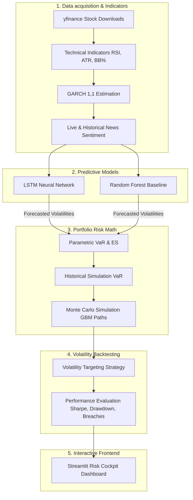

# 🛡️ AlphaGuard: Volatility Predictor & Portfolio Risk Cockpit

AlphaGuard is a production-grade, multi-asset quantitative risk management dashboard. It bridges time-series statistical modeling, machine learning (LSTM/Random Forest), and portfolio theory to calculate tail risk and simulate dynamic risk-management strategies.

---

## 🎯 Project Core Purpose
In finance, **volatility is synonymous with risk**. Traditional risk managers rely on static rolling historical measures to estimate portfolio exposure. However, market volatility is characterized by **volatility clustering** (periods of high volatility followed by high volatility, and low by low). 

AlphaGuard solves this by predicting tomorrow's risk dynamically:
* It estimates asset conditional volatilities using a hybrid of **GARCH(1,1)** models and **Deep Learning (LSTM)**.
* It uses these forecasts to dynamically calculate portfolio-level **Value at Risk (VaR)** and **Expected Shortfall (ES)**.
* It simulates **Volatility Targeting Backtests** to adjust asset allocations, aiming to minimize drawdowns during extreme selloffs.

---

## 🏗️ System Architecture & Data Flow

---

## 💡 How it Helps (The Value Proposition)

### 1. Advanced Tail Risk Protection
By computing **Expected Shortfall (ES)** (or Conditional VaR), AlphaGuard tells you what the average loss will be in the worst $(1-\alpha)\%$ cases. This helps institutional traders and retail investors identify extreme tail risks and size their portfolios to survive "black swan" market crashes.

### 2. Volatility-Targeted Asset Allocation
Rather than holding a static 60/40 or 100/0 portfolio, the backtester implements **Volatility Targeting**:
$$\text{Weight}_t = \min\left(1.0, \frac{\sigma_{\text{target}}}{\hat{\sigma}_t}\right)$$
When forecasted volatility ($\hat{\sigma}_t$) spikes, the model automatically shifts exposure to risk-free cash, insulating capital. When the market calms, it raises exposure back to 100%. This maximizes the **Sharpe and Sortino Ratios** over long horizons.

### 3. Stress-Testing Shocks
The system includes a macro simulator. Traders can drag sliders to apply percentage shocks to individual stocks (e.g. a Tech crash or S&P selloff) to instantly evaluate the resulting portfolio value decline, correlation behavior, and risk concentration.

---

## 🛠️ Codebase Components

* **[config.yaml](file:///c:/my_local_data(one%20drive)/Attachments/Ambition%20course/my_all_projects/project%2071%20risk%20management/config.yaml)**: Configuration settings for tickers, sequence windows, epochs, and risk confidence.
* **[data_pipeline.py](file:///c:/my_local_data(one%20drive)/Attachments/Ambition%20course/my_all_projects/project%2071%20risk%20management/data_pipeline.py)**: Handles data download, technical features, GARCH fitting, and sentiment scoring.
* **[models.py](file:///c:/my_local_data(one%20drive)/Attachments/Ambition%20course/my_all_projects/project%2071%20risk%20management/models.py)**: Encapsulates training/inference pipelines for LSTM and Random Forest models.
* **[risk_math.py](file:///c:/my_local_data(one%20drive)/Attachments/Ambition%20course/my_all_projects/project%2071%20risk%20management/risk_math.py)**: Computes multi-asset Historical, Parametric, and Monte Carlo VaR & Expected Shortfall.
* **[backtester.py](file:///c:/my_local_data(one%20drive)/Attachments/Ambition%20course/my_all_projects/project%2071%20risk%20management/backtester.py)**: Handles volatility targeting simulation and backtest validation metrics.
* **[app.py](file:///c:/my_local_data(one%20drive)/Attachments/Ambition%20course/my_all_projects/project%2071%20risk%20management/app.py)**: Interactive Streamlit user interface.
