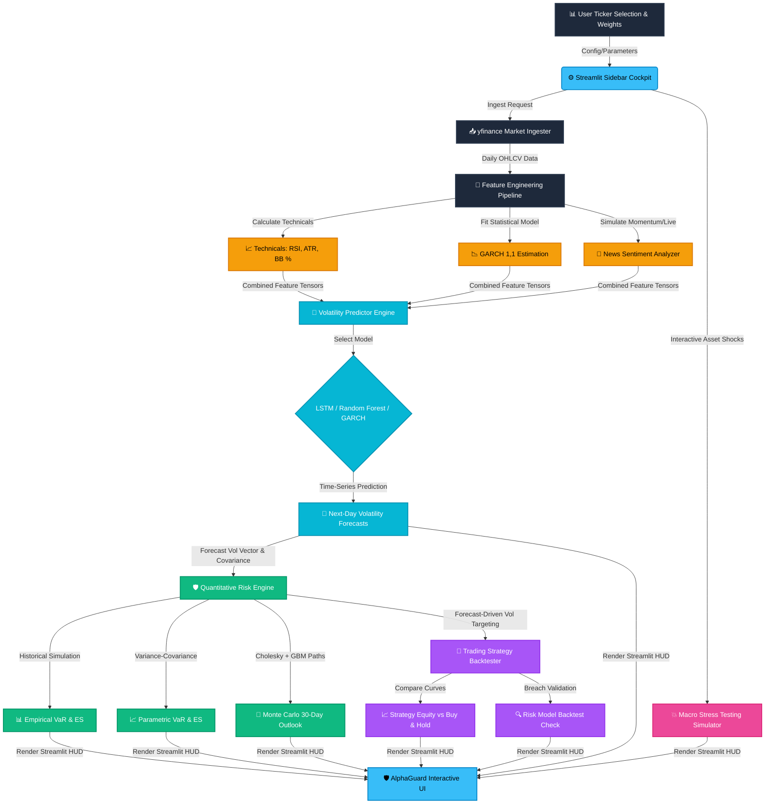

<div align="center">

# 🛡️ AlphaGuard — Portfolio Risk Cockpit & Volatility Predictor

### 📊 **Multi-Asset Financial Risk Intelligence with Deep Learning & GARCH Modeling**

[](https://git.io/typing-svg)


<br/>

### **Where Quantitative Finance Meets Deep Learning.**
### **Transform historical market data into predicted portfolio risk budgets. Predict tail-risk breaches, run macro stress tests, and backtest volatility targeting strategies in real-time.** 📈🛡️

</div>

---

## 📉 **THE PROBLEM & THE ALPHAGUARD SOLUTION**

Traditional financial risk management systems often rely on **historical rolling averages**, which fail to capture rapid changes in market conditions (known as **volatility clustering**). Underestimating volatility leads to portfolio blowups during sudden market crashes.

**AlphaGuard** is a production-grade quantitative risk management system and interactive financial analytics cockpit. By combining conditional statistical models (GARCH) with deep learning (LSTM) and machine learning (Random Forest), it forecasts tomorrow's risk dynamically. It then pipes these forecasts into a quantitative risk engine to compute **Value-at-Risk (VaR)** and **Expected Shortfall (ES)** across multiple methodologies, backtests a dynamic cash-hedged **Volatility Targeting Strategy**, and simulates **Macro Shock Propagation**.

---

## 🎛️ **DASHBOARD COCKPIT & ANALYTICAL MATRIX**

AlphaGuard integrates a variety of quantitative modules into a multi-tab Streamlit dashboard:

| Dashboard Tab | Under-the-Hood Engine | Key Visualizations | Risk Metric Portrayed |
| :--- | :--- | :--- | :--- |
| **📈 Volatility Forecasts** | LSTM / Random Forest / GARCH(1,1) | Interactive Plotly Line chart showing historical vol range vs GARCH vol and star marker for predicted next-day vol | Next-day predicted asset volatility alongside live news sentiment word-matching from Yahoo Finance |
| **🛡️ VaR Math Comparison** | Parametric, Historical, Monte Carlo | Grouped Bar Chart of VaR vs Expected Shortfall (ES) across methods | Portfolio-level Value at Risk & Expected Shortfall comparison (both % and dollar-denominated) |
| **🔮 Monte Carlo Projections** | Geometric Brownian Motion (GBM) | 5,000 paths projection with highlighted 95th, 50th, and 5th percentiles | 30-day forward-looking portfolio wealth path distribution and potential dollar losses |
| **📊 Portfolio Analytics** | Covariance & Correlation Matrix | Current asset allocation Donut chart and RdBu correlation heatmap | Asset diversification benefits, portfolio asset return dependencies, and weights configuration |
| **🔄 Risk Backtesting** | Volatility Targeting Simulator | Interactive Equity Curve (Strategy vs Buy & Hold) | Volatility targeting performance, Sharpe/Sortino ratios, max drawdown reduction, and VaR breach validation |
| **💥 Macro Stress Testing** | Linear Shock Propagation | Instantaneous portfolio return bar charts and metric tiles | Hypothetical macro shocks (e.g. user-defined % changes per asset) showing estimated net dollar impact |

---

## ⚡ **SYSTEM ARCHITECTURE FLOW**

The flowchart below demonstrates how the Streamlit dashboard, data processing modules, machine learning algorithms, and mathematical engines collaborate to produce real-time risk calculations:



---

## 🔬 **MATHEMATICAL & MODELING SPOTLIGHT**

Under the hood, the risk mathematics engine in [risk_math.py](file:///c:/my_local_data%28one%20drive%29/Attachments/Ambition%20course/my_all_projects/project%2071%20risk%20management/risk_math.py) computes portfolio analytics. Below is a deep dive into the formulas and implementation:

### **1. Value at Risk (VaR) & Expected Shortfall (ES)**
* **Historical Simulation (Non-parametric)**:
  Uses the empirical distribution of returns over a 252-day lookback window:
  $$VaR_{\alpha}^{Hist} = -Percentile(R_{portfolio}, (1-\alpha) \times 100)$$
  $$ES_{\alpha}^{Hist} = -E\left[R_{portfolio} \;\middle|\; R_{portfolio} \le -VaR_{\alpha}^{Hist}\right]$$
  
* **Parametric Variance-Covariance (Normal Distribution)**:
  $$VaR_{\alpha}^{Param} = -(\mu_{p} - Z_{\alpha} \sigma_{p})$$
  $$ES_{\alpha}^{Param} = -\left(\mu_{p} - \sigma_{p} \frac{\phi(Z_{\alpha})}{1 - \alpha}\right)$$
  Where $w$ is the vector of portfolio weights, $\Sigma$ is the correlation-aligned covariance matrix, $\sigma_{p} = \sqrt{w^T \Sigma w}$ is the portfolio volatility, $Z_{\alpha}$ is the normal distribution inverse CDF at confidence level $\alpha$, and $\phi(x)$ is the normal probability density function (PDF).

### **2. Monte Carlo Simulation Engine**
The simulator runs $5,000$ daily price paths using **Geometric Brownian Motion (GBM)** over a 30-day trading horizon. It models correlation dependencies via **Cholesky Decomposition**:
$$\text{Given correlation matrix } C \rightarrow C = L L^T \quad \text{(where } L \text{ is lower-triangular)}$$
$$\text{Correlated random shocks: } \epsilon = S \cdot L \cdot Z$$
Where $Z \sim \mathcal{N}(0, I_N)$ represents independent standard normals, $S = \text{diag}(\sigma_1, \dots, \sigma_N)$ represents asset standard deviations, and the price update is calculated as:
$$S_{i, t} = S_{i, t-1} \exp\left( \left(\mu_{i} - \frac{1}{2}\sigma_{i}^2\right)dt + \epsilon_{i}\sqrt{dt} \right)$$
$$\text{Portfolio Value } P_t = \sum_{i=1}^N S_{i, t}$$

### **3. Volatility Targeting Strategy**
Simulated in [backtester.py](file:///c:/my_local_data%28one%20drive%29/Attachments/Ambition%20course/my_all_projects/project%2071%20risk%20management/backtester.py#L10), the strategy dynamically adjusts portfolio leverage ($Leverage_t$) to match an annualized target volatility (e.g., $15\%$):
$$Leverage_{t} = \text{clip}\left(\frac{\sigma_{target}^{daily}}{\sigma_{predicted, t-1}^{daily}}, 0, 1\right)$$
$$R_{strategy, t} = Leverage_{t-1} \cdot R_{portfolio, t} + (1 - Leverage_{t-1}) \cdot R_{risk\_free}$$

---

## 🛠️ **TECHNOLOGY STACK**

```
 🖥️ User Dashboard  --->  Streamlit (Obsidian Sky-Blue Theme)
 📈 Math Engine      --->  SciPy / NumPy / pandas_ta / arch GARCH(1,1)
 🧠 Neural Network   --->  TensorFlow 2.x Keras (Deep Learning LSTM)
 💾 Machine Learning --->  Scikit-Learn (Random Forest Regressor)
 📊 Visualization    --->  Plotly Express & Plotly Graph Objects
 ⚙️ Ingester         --->  Yahoo Finance API (yfinance)
```

---

## 📂 **PROJECT BLUEPRINT & DIRECTORY NAVIGATION**

```text
project-71-risk-management/
│
├── 📂 saved_models/                 # Local directory for serialized ML models
│   ├── 📜 AAPL_lstm_model.keras     # Trained TensorFlow LSTM models
│   └── 📜 AAPL_scaler.pkl           # Feature normalizer scalers
│
├── 📜 app.py                        # Streamlit obsidian dark-mode dashboard HUD
├── 📜 backtester.py                 # Volatility targeting strategy backtest engine
├── 📜 config.yaml                   # Customizable tickers, lookback, and risk parameters
├── 📜 data_pipeline.py              # Market data download, technical features, sentiment
├── 📜 models.py                     # VolatilityPredictor class (LSTM & Random Forest)
├── 📜 risk_math.py                  # Analytical VaR/ES and Monte Carlo simulation math
├── 📜 requirements.txt              # Standard project package dependencies
└── 📖 README.md                     # Main Dashboard Documentation (You are here!)
```

*File & Symbol Navigation Links:*
* **Dashboard HUD**: [app.py](file:///c:/my_local_data%28one%20drive%29/Attachments/Ambition%20course/my_all_projects/project%2071%20risk%20management/app.py)
* **Volatility Forecasting**: [models.py](file:///c:/my_local_data%28one%20drive%29/Attachments/Ambition%20course/my_all_projects/project%2071%20risk%20management/models.py) featuring class [VolatilityPredictor](file:///c:/my_local_data%28one%20drive%29/Attachments/Ambition%20course/my_all_projects/project%2071%20risk%20management/models.py#L12)
* **Risk Engine**: [risk_math.py](file:///c:/my_local_data%28one%20drive%29/Attachments/Ambition%20course/my_all_projects/project%2071%20risk%20management/risk_math.py) containing mathematical functions [calculate_historical_var_es](file:///c:/my_local_data%28one%20drive%29/Attachments/Ambition%20course/my_all_projects/project%2071%20risk%20management/risk_math.py#L19), [calculate_parametric_var_es](file:///c:/my_local_data%28one%20drive%29/Attachments/Ambition%20course/my_all_projects/project%2071%20risk%20management/risk_math.py#L33), and [run_monte_carlo_simulation](file:///c:/my_local_data%28one%20drive%29/Attachments/Ambition%20course/my_all_projects/project%2071%20risk%20management/risk_math.py#L61)
* **Strategy Backtester**: [backtester.py](file:///c:/my_local_data%28one%20drive%29/Attachments/Ambition%20course/my_all_projects/project%2071%20risk%20management/backtester.py) featuring class [VolatilityBacktester](file:///c:/my_local_data%28one%20drive%29/Attachments/Ambition%20course/my_all_projects/project%2071%20risk%20management/backtester.py#L5)
* **Data Processing & GARCH**: [data_pipeline.py](file:///c:/my_local_data%28one%20drive%29/Attachments/Ambition%20course/my_all_projects/project%2071%20risk%20management/data_pipeline.py) featuring function [fit_garch_volatility](file:///c:/my_local_data%28one%20drive%29/Attachments/Ambition%20course/my_all_projects/project%2071%20risk%20management/data_pipeline.py#L79)
* **System Settings**: [config.yaml](file:///c:/my_local_data%28one%20drive%29/Attachments/Ambition%20course/my_all_projects/project%2071%20risk%20management/config.yaml)

---

## 🚀 **GETTING STARTED & SETUP GUIDE**

Follow these quick commands to spin up the AlphaGuard dashboard on your local machine:

### **1. Enter Directory**
Open your terminal and change into the project directory:
```powershell
cd "project 71 risk management"
```

### **2. Install Dependencies**
Install all required mathematical, visualization, and machine learning packages:
```powershell
pip install -r requirements.txt
```

### **3. Run the Dashboard**
Launch the Streamlit web server:
```powershell
streamlit run app.py
```
After execution, open your web browser and navigate to:
👉 **`http://localhost:8501`**

---

## 👨‍💼 **CONNECT WITH THE DEVELOPER**

<div align="center">

[](https://github.com/mayank-goyal09)
[](https://www.linkedin.com/in/mayank-goyal-4b8756363/)
[](https://mayank-goyal09.github.io/)

**Mayank Goyal**  
🧠 Quantitative Finance Engineer | 🛡️ Deep Learning Risk Architect | 🤖 Automation Developer

</div>

---

<div align="center">

### **Crafted with ❤️ by Mayank Goyal**
*"Quantify the risk. Predict the trend. Guard the future."* 🛡️⚡📈


</div>
